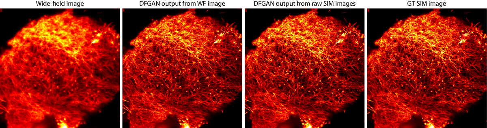

# DFCAN/DFGAN

**DFCAN/DFGAN software** is the tensorflow/keras implementation for image transformation from low-resolution (LR) image to super-resolved one, including single wide-field (WF) image super-resolution prediction and SIM reconstruction. This repository is developed based on the 2021 Nature Methods paper [**Evaluation and development of deep neural networks for image super-resolution in optical microscopy**](https://doi.org/10.1038/s41592-020-01048-5).<br>

Author: Chang Qiao<sup>1,#</sup>, Di Li<sup>2,#</sup>, Yuting Guo<sup>2,#</sup>, Chong Liu<sup>2,3,#</sup>, Tao Jiang<sup>2,3</sup>, Qionghai Dai<sup>1,+</sup>, Dong Li<sup>2,3,4,+</sup><br>
<sup>1</sup>Department of Automation, Tsinghua University, Beijing, China.<br>
<sup>2</sup>National Laboratory of Biomacromolecules, CAS Center for Excellence in Biomacromolecules, Institute of Biophysics, Chinese Academy of Sciences, Beijing, China.<br>
<sup>3</sup>College of Life Sciences, University of Chinese Academy of Sciences, Beijing, China.<br>
<sup>4</sup>Bioland Laboratory, Guangzhou Regenerative Medicine and Health Guangdong Laboratory, Guangzhou, China.<br>
<sup>#</sup>Equal contribution.  
<sup>+</sup>Correspondence to: qhdai@tsinghua.edu.cn and lidong@ibp.ac.cn

## Contents
- [Environment](#environment)
- [File structure](#file-structure)
- [BioSR dataset](#biosr-dataset)
- [Test pre-trained models](#test-pre-trained-models)
- [Train a new model](#train-a-new-model)
- [License](#License)
- [Citation](#citation)

## Environment
- Ubuntu 16.04
- CUDA 9.0.16
- Python 3.6.10
- Tensorflow 1.10.0
- Keras 2.2.4
- GPU: GeForce RTX 2080Ti

## File structure
- `./dataset` is the default path for training data and testing data
    - `./dataset/train` The augmented training image patch pairs will be saved here by default
    - `./dataset/test` includes some demo images of F-actin and microtubules to test DFCAN/DFGAN models
- `./src` includes the source codes of DFCAN and DFGAN
	- `./src/models` includes declaration of DFCAN and DFGAN models
	- `./src/utils` is the tool package of DFCAN/DFGAN software
- `./trained_models` place pre-trained DFGAN/DFCAN models here for testing, and newly trained models will be saved here by default
- `./data_agmt_matlab` includes matlab codes used for data augmentation (matlab version: MATLAB 2017b)

## BioSR dataset
[BioSR](https://figshare.com/articles/dataset/BioSR/13264793) is a biological image dataset for super-resolution microscopy, currently including more than 2200 pairs of low-and-high resolution images covering four biology structures (CCPs, ER, MTs, F-actin), nine signal levels (15-600 average photon count), and two upscaling-factors (linear SIM and non-linear SIM). BioSR is now freely available, aiming to provide a high-quality dataset for the community of single bio-image super-resolution algorithm and advanced SIM reconstruction algorithm developers.

## Test pre-trained models
- Download [pre-trained models](https://doi.org/10.6084/m9.figshare.13531292) of DFCAN/DFGAN and place them in `./trained_models/`
- Download [test data](https://doi.org/10.6084/m9.figshare.13531436) and place them in `./dataset/test`. Also, you can download [BioSR](https://figshare.com/articles/dataset/BioSR/13264793) for more testing data
- Open your terminal and cd to `./src`
- Run `bash demo_predict.sh` in your terminal. Note that before running the bash file, you should check if the data paths and other arguments in `demo_predict.sh` are set correctly
- The output SR images will be saved in `--data_dir`
- Typical results:<br>
<p align="center"></p>

## Train a new model
- Data for training: You can train a new DFCAN/DFGAN model using [BioSR](https://doi.org/10.1038/s41592-020-01048-5) or your own datasets. Note that you'd better divide the dataset of each specimen into training part and validation/testing part before training, so that you can test your model with the preserved validation/testing data
- Data augumentation: run `./data_agmt_matlab/DataAugmentation_ForTrain.m` with MATLAB to creat image patch pairs of BioSR datasets. Before running, you should check image paths and some parameters following the instructions in `./data_agmt_matlab/DataAugumentation_ForTrain.m`. After running, the augumented data is saved in `./dataset/train` by default
- Run `bash demo_train.sh` in your terminal to train a new DFCAN model. Similar to testing, before running the bash file, you should check if the data paths and the arguments are set correctly
- You can run `tensorboard --logdir [save_weights_dir]/[save_weights_name]/graph` to monitor the training process via tensorboard. If the validation loss isn't likely to decay any more, you can use early stop strategy to end the training
- Model weights will be saved in `./trained_models/` by default

## License
This repository is released under the MIT License (refer to the LICENSE file for details).

## Citation
If you find the code or BioSR dataset helpful in your resarch, please cite the following paper:
```
@article{qiao2021evaluation,
  title={Evaluation and development of deep neural networks for image super-resolution in optical microscopy},       
  author={Chang Qiao, Di li, Yuting Guo, Chong Liu, Tao Jiang, Qionghai Dai and Dong Li},
  journal={Nature Methods},
  pages={194-202},
  year={2021},
  publisher={Nature Publishing Group}
}
```
